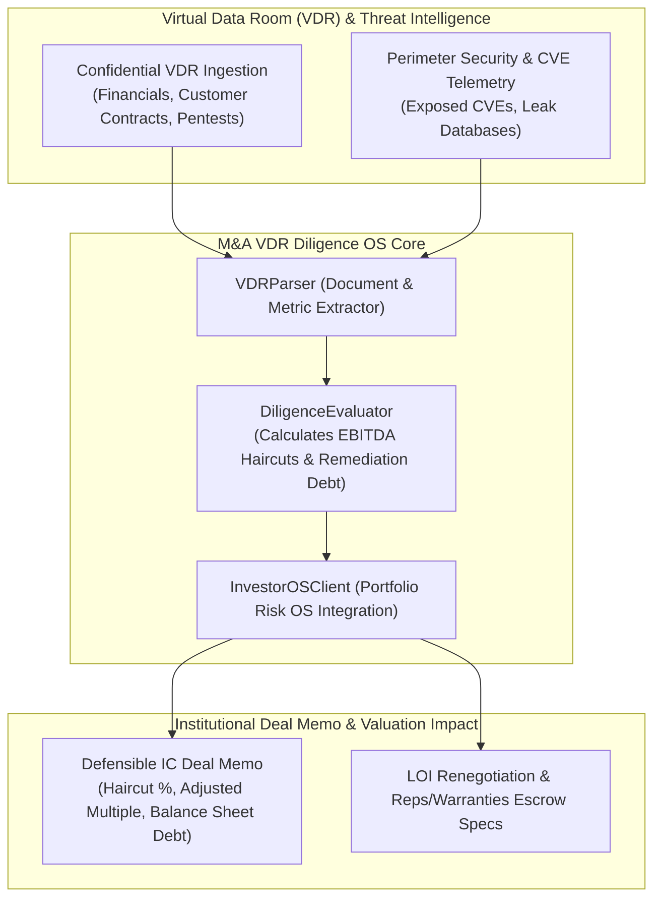

# 💼 M&A VDR Diligence OS (Herjavec Group Portfolio Risk OS)

**Confidential & Proprietary Institutional Technology**  
*Integrated with [Herjavec Group Portfolio Risk OS](https://investor-os.vercel.app)*

---

## 🎯 Executive Summary
Traditional M&A technical due diligence from Big 4 accounting and technical consulting firms takes **3–4 weeks** and costs **$75,000–$150,000 per deal**, relying on subjective interviews and manual checklist reviews.

**M&A VDR Diligence OS** automates technical and cyber due diligence in **48 hours**, analyzing Virtual Data Room (VDR) documents, pentest reports, and cloud perimeters to compute **statistically defensible EBITDA valuation haircuts** and cyber technical debt liabilities before Letter of Intent (LOI) or deal closing.

---

## 📐 Mathematical Diligence Methodology
Derived from `project-atlas-due-diligence` models:

$$Adjusted\_EV = (Reported\_EBITDA \times Adjusted\_Multiple) - Direct\_Cyber\_Liabilities$$

1. **Direct Cyber Debt Liabilities**:
   $$\text{Debt}_{CVE} = (N_{crit} \times \$25,000) + (N_{high} \times \$8,000) + (N_{med} \times \$2,000) + (N_{leak} \times \$50,000)$$
2. **Compliance & Revenue Risk Discount**:
   * **Missing SOC 2 Type II**: $-10\%$ multiple haircut (enterprise sales friction & pipeline risk).
   * **Qualified Auditor Opinion**: $-5\%$ multiple haircut.
   * **Customer Concentration ($>35\%$ top 3)**: $-8\%$ revenue hazard haircut.

---

## ⚡ Architecture & Diligence Pipeline



---

## 🚀 Terminal Diligence Run

```bash
# Execute diligence sprint on acquisition target
python3 -m projects.ma_vdr_diligence_os.run_deal_audit \
  --company "Apex Financial Technologies Inc." \
  --ebitda 6500000 \
  --multiple 14.0 \
  --concentration 0.38 \
  --critical-cves 3 \
  --high-cves 7
```

### Sample Output Memo
```text
================================================================================
💼 HERJAVEC GROUP - PORTFOLIO RISK OS | M&A DUE DILIGENCE SCORECARD
================================================================================
Target Company:            Apex Financial Technologies Inc.
Reported LTM EBITDA:       $6,500,000.00
Baseline Multiple:         14.0x
Baseline Enterprise Value: $91,000,000.00
--------------------------------------------------------------------------------
🔍 QUANTITATIVE RISK ADJUSTMENTS & DILIGENCE FINDINGS:
  [1] Elevated cyber technical debt: $180,000.00 in remediation liabilities
  [2] Missing SOC 2 Type II certification; enterprise sales friction risk
  [3] High customer concentration: Top 3 clients represent 38.0% of ARR
  • Direct Cyber Debt Liability:      -$180,000.00
  • Adjusted Enterprise Multiple:      11.62x
  • Adjusted Enterprise Value:        $75,350,000.00
================================================================================
🎯 RECOMMENDED VALUATION HAIRCUT:      -$15,650,000.00 (17.2%)
📌 INVESTMENT COMMITTEE DECISION:      PROCEED_WITH_VALUATION_ADJUSTMENT
🌐 Ingested into Herjavec Risk OS:     https://investor-os.vercel.app/deals/deal_78a1f29b
================================================================================
```

---

## 💼 Institutional Commercial Model

| Engagement Format | Target Client | Price | Scope |
| :--- | :--- | :--- | :--- |
| **Pre-LOI Quick Diligence** | Buyout Funds & Search Funds | **$18,500 / deal** | 48-hr turnaround, external perimeter scan + VDR check. |
| **Comprehensive M&A Diligence Sprint** | Private Equity ($25M–$250M deals) | **$45,000 / deal** | Full 867-control maturity check, pen-test CVE debt, defensible haircut report. |
| **PE Operating Partner Annual Retainer** | Buyout Firms (Active deal pipeline) | **$25,000 / month** ($300k/yr) | Unlimited diligence sprints (up to 12 deals/yr) + quarterly portfolio monitoring in Investor OS. |

---

## 🔒 Confidentiality & License
This technology is strictly proprietary and confidential. Direct all inquiries to [Herjavec Group Portfolio Risk OS](https://investor-os.vercel.app).
